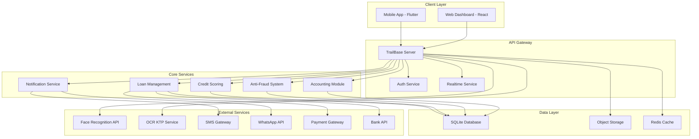

# Konsep Aplikasi Pinjol "KreditKu" 
## Sistem Pinjaman Online Berbasis TrailBase

---

## Executive Summary

KreditKu adalah aplikasi pinjaman online (pinjol) yang dirancang untuk melayani masyarakat Indonesia khususnya di wilayah Jabodetabek dan Bandung Raya. Aplikasi ini dibangun menggunakan TrailBase sebagai backend foundation dengan fokus pada kemudahan penggunaan, keamanan tinggi, dan kecepatan layanan. Sistem ini mendukung dua jenis pinjaman: konvensional dan syariah, dengan tenor fleksibel 7-90 hari dan limit pinjaman 1-50 juta rupiah.

### Keunggulan Utama:
- **Performa Tinggi**: Menggunakan TrailBase dengan latensi sub-milidetik
- **Dual Financing**: Mendukung skema konvensional dan syariah
- **Smart Verification**: Facial recognition + KTP checker terintegrasi
- **Anti-Fraud System**: Deteksi fraud otomatis dengan machine learning
- **Full Digital**: 100% proses online dari pengajuan hingga pencairan
- **Multi-channel Payment**: Transfer bank dan e-wallet

---

## 1. Informasi Produk

### 1.1 Identitas Aplikasi
- **Nama Aplikasi**: KreditKu
- **Tagline**: "Pinjaman Cepat, Amanah, dan Terpercaya"
- **Target Market**: Masyarakat produktif usia 21-55 tahun di Jabodetabek & Bandung Raya
- **Versi Initial**: 1.0.0

### 1.2 Jenis Layanan Pinjaman

#### A. Pinjaman Konvensional
- **Bunga**: 0.8% per hari (max sesuai OJK)
- **Biaya Admin**: 3% dari pokok pinjaman
- **Denda Keterlambatan**: 0.5% per hari
- **Asuransi**: Optional (1.5% dari pokok)

#### B. Pinjaman Syariah
- **Akad**: Murabahah/Qardh
- **Margin**: Ujroh 0.7% per hari
- **Biaya Admin**: 2.5% dari pokok
- **Ta'widh (Ganti Rugi)**: 0.3% per hari
- **Takaful**: Optional (1.5% dari pokok)

### 1.3 Ketentuan Pinjaman
- **Limit Pinjaman**: Rp 1.000.000 - Rp 50.000.000
- **Tenor**: 7 hari - 90 hari
- **Metode Pencairan**: Transfer bank (BCA, Mandiri, BNI, BRI)
- **Waktu Pencairan**: 15 menit - 24 jam
- **Metode Pembayaran**:
  - Transfer Bank (Virtual Account)
  - E-Wallet: DANA, GoPay, OVO, ShopeePay
  - Convenience Store: Indomaret, Alfamart

### 1.4 Area Layanan
**Jabodetabek:**
- Jakarta (Pusat, Utara, Selatan, Timur, Barat)
- Bogor (Kota & Kabupaten)
- Depok
- Tangerang (Kota & Kabupaten)
- Bekasi (Kota & Kabupaten)

**Bandung Raya:**
- Kota Bandung
- Kabupaten Bandung
- Kabupaten Bandung Barat
- Kota Cimahi

---

## 2. Arsitektur Teknologi

### 2.1 Tech Stack Overview

#### Backend Core
- **Application Server**: TrailBase (Rust + SQLite + V8)
- **Database**: SQLite (built-in TrailBase)
- **Auth System**: TrailBase JWT + Refresh Token
- **Runtime**: TrailBase JS/ES6/TS Runtime
- **API**: REST + Realtime (WebSocket)

#### Web Dashboard (Pengelola)
- **Framework**: React 18 + TypeScript
- **UI Library**: Ant Design Pro 5
- **State Management**: Zustand
- **Chart Library**: Apache ECharts
- **Map**: OpenStreetMap + Leaflet
- **Form Handling**: React Hook Form + Zod

#### Mobile App (Nasabah)
- **Framework**: Flutter 3.x
- **State Management**: Riverpod
- **Local Storage**: Hive
- **HTTP Client**: Dio
- **Push Notification**: Firebase Cloud Messaging

#### Supporting Services
- **Face Recognition**: Amazon Rekognition / Face++
- **OCR KTP**: Google Vision API / Tesseract
- **SMS Gateway**: Twilio / Vonage
- **Email Service**: SendGrid / AWS SES
- **WhatsApp API**: WhatsApp Business API
- **Payment Gateway**: Xendit / Midtrans
- **Cloud Storage**: AWS S3 / MinIO

### 2.2 System Architecture Diagram



### 2.3 TrailBase Configuration

#### Server Setup
```javascript
// traildepot/config.toml
[server]
host = "0.0.0.0"
port = 4000
max_db_connections = 100

[auth]
jwt_secret = "your-secret-key"
access_token_expiry = "15m"
refresh_token_expiry = "7d"
password_reset_expiry = "1h"

[security]
cors_origins = ["https://admin.kreditku.id", "app://kreditku"]
rate_limit = 100
max_upload_size = "10MB"

[database]
path = "./traildepot/kreditku.db"
wal_mode = true
journal_mode = "WAL"

[storage]
provider = "s3"
bucket = "kreditku-assets"
region = "ap-southeast-1"
```

---

## 3. Database Schema

### 3.1 Core Tables

#### users
```sql
CREATE TABLE users (
    id TEXT PRIMARY KEY DEFAULT (lower(hex(randomblob(16)))),
    email TEXT UNIQUE NOT NULL,
    phone TEXT UNIQUE NOT NULL,
    password_hash TEXT NOT NULL,
    full_name TEXT NOT NULL,
    nik TEXT UNIQUE,
    birth_date DATE,
    gender TEXT CHECK(gender IN ('M', 'F')),
    address TEXT,
    province TEXT,
    city TEXT,
    district TEXT,
    postal_code TEXT,
    occupation TEXT,
    monthly_income INTEGER,
    marital_status TEXT,
    education TEXT,
    mother_name TEXT,
    emergency_contact TEXT,
    emergency_phone TEXT,
    user_type TEXT DEFAULT 'customer' CHECK(user_type IN ('customer', 'admin', 'collector')),
    status TEXT DEFAULT 'inactive' CHECK(status IN ('active', 'inactive', 'suspended', 'blacklisted')),
    kyc_status TEXT DEFAULT 'pending' CHECK(kyc_status IN ('pending', 'verified', 'rejected')),
    credit_score INTEGER DEFAULT 500,
    created_at DATETIME DEFAULT CURRENT_TIMESTAMP,
    updated_at DATETIME DEFAULT CURRENT_TIMESTAMP,
    last_login DATETIME,
    device_id TEXT,
    fcm_token TEXT
);
```

#### loans
```sql
CREATE TABLE loans (
    id TEXT PRIMARY KEY DEFAULT (lower(hex(randomblob(16)))),
    loan_number TEXT UNIQUE NOT NULL,
    user_id TEXT NOT NULL REFERENCES users(id),
    loan_type TEXT NOT NULL CHECK(loan_type IN ('conventional', 'sharia')),
    principal_amount INTEGER NOT NULL,
    interest_rate REAL NOT NULL,
    admin_fee INTEGER,
    insurance_fee INTEGER,
    tenor_days INTEGER NOT NULL,
    total_payment INTEGER NOT NULL,
    disbursement_date DATETIME,
    due_date DATETIME,
    status TEXT DEFAULT 'pending' CHECK(status IN (
        'pending', 'reviewing', 'approved', 'rejected', 
        'disbursed', 'active', 'paid', 'overdue', 'restructured', 'written_off'
    )),
    rejection_reason TEXT,
    disbursement_method TEXT,
    disbursement_account TEXT,
    purpose TEXT,
    location_lat REAL,
    location_lng REAL,
    location_address TEXT,
    credit_score_at_apply INTEGER,
    risk_level TEXT CHECK(risk_level IN ('low', 'medium', 'high', 'very_high')),
    created_at DATETIME DEFAULT CURRENT_TIMESTAMP,
    updated_at DATETIME DEFAULT CURRENT_TIMESTAMP
);
```

---

## 4. Core Features & Modules

### 4.1 Authentication & Authorization

#### Multi-Factor Authentication Flow
1. **Phone & Password Login**: Initial authentication
2. **OTP Verification**: SMS-based verification
3. **Device Registration**: Fingerprint for trusted devices
4. **Session Management**: JWT with refresh tokens

#### Role-Based Access Control (RBAC)
- **Customer**: Apply loan, view own data, make payments
- **Admin**: Full system access, approve/reject loans
- **Credit Analyst**: Review applications, verify KYC
- **Collector**: View overdue loans, send reminders
- **Accountant**: Financial reports, reconciliation

### 4.2 Credit Scoring System

#### Scoring Components (Total: 300-850)
1. **Base Score**: 500 points
2. **KYC Verification**: +100 points max
   - KTP verified: +30
   - Selfie verified: +30
   - Address verified: +20
   - Phone verified: +20
3. **Financial Factors**: +200 points max
   - Monthly income level
   - Employment status
   - Financial obligations
4. **Behavioral Factors**: +200 points max
   - Payment history
   - Loan frequency
   - App usage pattern
5. **Risk Deductions**: -200 points max
   - Blacklist status
   - Fraud indicators
   - Multiple devices

### 4.3 KYC & Identity Verification

#### Verification Process
1. **Document Upload**
   - KTP photo (front)
   - Selfie photo
   - Selfie with KTP

2. **OCR Processing**
   - Extract NIK, name, address
   - Validate NIK format
   - Cross-check with Dukcapil (if available)

3. **Face Recognition**
   - Liveness detection
   - Face matching with KTP
   - Quality assessment

4. **Manual Review** (if needed)
   - Admin verification
   - Document authenticity check

### 4.4 Anti-Fraud System

#### Fraud Detection Layers
1. **Device Fingerprinting**
   - Device ID tracking
   - Root/jailbreak detection
   - Emulator detection
   - VPN/proxy detection

2. **Behavioral Analysis**
   - Rapid applications detection
   - Unusual location patterns
   - Abnormal usage hours
   - Form filling patterns

3. **Document Verification**
   - KTP duplicate check
   - Image manipulation detection
   - Face spoofing detection

4. **Network Analysis**
   - Shared bank accounts
   - Referral chain analysis
   - Social network fraud rings

### 4.5 Loan Management

#### Loan Lifecycle
1. **Application**: User submits loan request
2. **Auto-Screening**: Credit score & fraud check
3. **Manual Review**: For borderline cases
4. **Approval/Rejection**: Decision with reasons
5. **Disbursement**: Fund transfer to user
6. **Active Monitoring**: Payment tracking
7. **Collection**: For overdue loans
8. **Closure**: Loan fully paid

### 4.6 Payment System

#### Payment Channels
1. **Bank Transfer**
   - Virtual Account (VA)
   - Manual transfer with unique code

2. **E-Wallets**
   - DANA
   - GoPay
   - OVO
   - ShopeePay

3. **Retail Outlets**
   - Indomaret
   - Alfamart

#### Payment Processing
- Real-time payment confirmation
- Automatic loan status update
- Receipt generation
- Notification to user

### 4.7 Notification System

#### Notification Types
1. **Transactional**
   - Loan approved/rejected
   - Disbursement success
   - Payment received

2. **Reminders**
   - Payment due (H-7, H-3, H-1)
   - Overdue notifications
   - Document expiry

3. **Marketing** (with consent)
   - New features
   - Promotions
   - Loyalty rewards

#### Delivery Channels
- Push notifications (primary)
- SMS (critical only)
- WhatsApp (with opt-in)
- Email (documentation)
- In-app notifications

### 4.8 Accounting Module

#### Accounting Features
1. **Journal Entries**
   - Automated double-entry bookkeeping
   - Disbursement recording
   - Payment recording
   - Fee & interest tracking

2. **Financial Reports**
   - Income Statement
   - Balance Sheet
   - Cash Flow Statement
   - Aging Report

3. **Reconciliation**
   - Bank reconciliation
   - Payment gateway reconciliation
   - Daily closing

### 4.9 Location Services

#### Geo-Features
1. **Service Area Validation**
   - Check if user is in service area
   - Nearest branch/agent locator

2. **Risk Assessment**
   - Location consistency check
   - High-risk area detection

3. **Visual Mapping**
   - Loan distribution heatmap
   - Collection route optimization
   - Risk zone visualization

---

## 5. Implementation Roadmap

### Phase 1: Foundation (Minggu 1-4)
- Setup TrailBase server & konfigurasi
- Implementasi database schema
- Authentication & authorization system
- Basic user management
- Development environment setup

### Phase 2: Core Backend (Minggu 5-8)
- KYC verification system
- Credit scoring algorithm
- Loan application workflow
- Payment gateway integration
- Basic fraud detection

### Phase 3: Mobile App Development (Minggu 9-12)
- Flutter project setup
- Authentication screens
- Loan application flow
- KYC document upload
- Payment integration
- Profile management

### Phase 4: Admin Dashboard (Minggu 13-16)
- React dashboard setup
- User management interface
- Loan approval workflow
- Reporting modules
- Analytics dashboard
- System configuration

### Phase 5: Advanced Features (Minggu 17-20)
- Machine learning fraud model
- Advanced credit scoring
- Multi-channel notifications
- Complete accounting system
- Collection management
- Customer support tools

### Phase 6: Testing & Optimization (Minggu 21-24)
- Unit testing (80% coverage)
- Integration testing
- Performance optimization
- Security audit
- UAT preparation
- Bug fixes & refinements

### Phase 7: Deployment Preparation (Minggu 25-26)
- Production environment setup
- Monitoring & logging setup
- Backup & disaster recovery
- Documentation completion
- Team training
- Soft launch preparation

### Phase 8: Launch & Monitoring (Minggu 27-28)
- Soft launch (limited users)
- Performance monitoring
- User feedback collection
- Issue resolution
- Gradual rollout
- Full launch preparation

---

## 6. Security Implementation

### 6.1 Application Security

#### Authentication Security
- Password complexity requirements
- Account lockout after failed attempts
- Two-factor authentication
- Biometric authentication support
- Session timeout management

#### Data Security
- AES-256 encryption at rest
- TLS 1.3 for data in transit
- Field-level encryption for PII
- Secure key management
- Regular security audits

#### API Security
- Rate limiting per endpoint
- API key management
- Request signing
- Input validation
- SQL injection prevention

### 6.2 Compliance & Privacy

#### Regulatory Compliance
- OJK POJK 77/2016 compliance
- AFPI membership requirements
- BI SLIK integration readiness
- Anti-money laundering (AML)
- Know Your Customer (KYC)

#### Data Privacy
- GDPR-ready architecture
- User consent management
- Data retention policies
- Right to erasure support
- Data portability features

---

## 7. Monitoring & Operations

### 7.1 System Monitoring

#### Key Metrics
- API response time (< 500ms p95)
- System uptime (99.9% SLA)
- Error rate (< 1%)
- Database performance
- User activity metrics

#### Monitoring Tools
- Application Performance Monitoring (APM)
- Log aggregation & analysis
- Real-time alerting
- Custom dashboards
- Incident management

### 7.2 Business Intelligence

#### Operational Metrics
- Daily active users
- Loan application volume
- Approval rate
- Disbursement rate
- NPL (Non-Performing Loan) rate
- Collection efficiency

#### Financial Metrics
- Revenue growth
- Interest income
- Operating costs
- Profit margins
- ROI analysis

---

## 8. Risk Management

### 8.1 Risk Categories

#### Credit Risk
- **Mitigation**: AI-based scoring, strict KYC, portfolio diversification
- **Monitoring**: NPL tracking, vintage analysis, recovery rate

#### Operational Risk
- **Mitigation**: Process automation, dual control, audit trails
- **Monitoring**: Error rates, processing time, system availability

#### Fraud Risk
- **Mitigation**: Multi-layer detection, device fingerprinting, behavioral analysis
- **Monitoring**: Fraud attempt rate, detection accuracy, loss amount

#### Regulatory Risk
- **Mitigation**: Compliance team, regular audits, legal consultation
- **Monitoring**: Regulatory changes, compliance scores, penalties

### 8.2 Business Continuity

#### Disaster Recovery Plan
- Recovery Time Objective (RTO): 4 hours
- Recovery Point Objective (RPO): 1 hour
- Daily backups to cloud storage
- Geographically distributed backups
- Regular disaster recovery drills

---

## 9. Kesimpulan

Aplikasi KreditKu dirancang sebagai solusi pinjaman online yang komprehensif dengan memanfaatkan teknologi TrailBase untuk performa optimal. Dengan kombinasi fitur-fitur canggih seperti facial recognition, credit scoring otomatis, dan sistem anti-fraud yang kuat, aplikasi ini siap melayani kebutuhan finansial masyarakat Indonesia dengan aman, cepat, dan terpercaya.

Key Success Factors:
1. **Teknologi Modern**: TrailBase memberikan performa superior
2. **User Experience**: Interface intuitif dan proses cepat
3. **Keamanan**: Multi-layer security dan fraud prevention
4. **Compliance**: Sepenuhnya mematuhi regulasi OJK
5. **Scalability**: Siap untuk pertumbuhan eksponensial
6. **Monitoring**: Real-time monitoring untuk operational excellence

---

## Sumber Referensi

1. TrailBase Documentation - https://trailbase.io
2. OJK Regulation POJK No.77/POJK.01/2016
3. AFPI (Asosiasi Fintech Pendanaan Bersama Indonesia) Guidelines
4. Flutter Best Practices - https://flutter.dev/docs
5. React Development Guide - https://react.dev
6. SQLite Performance Guide - https://sqlite.org/whentouse.html
7. OWASP Security Standards - https://owasp.org
8. ISO 27001 Information Security Management

---

*Dokumen ini adalah konsep awal dan dapat disesuaikan sesuai kebutuhan bisnis serta perkembangan regulasi yang berlaku.*