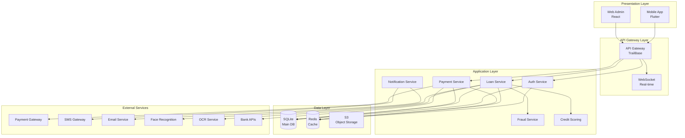
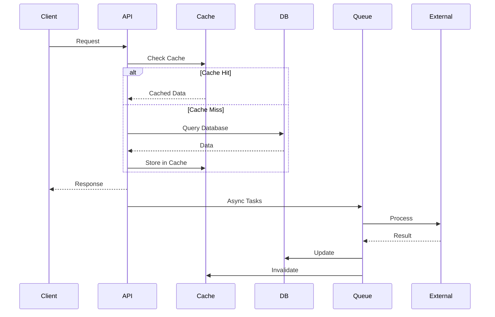
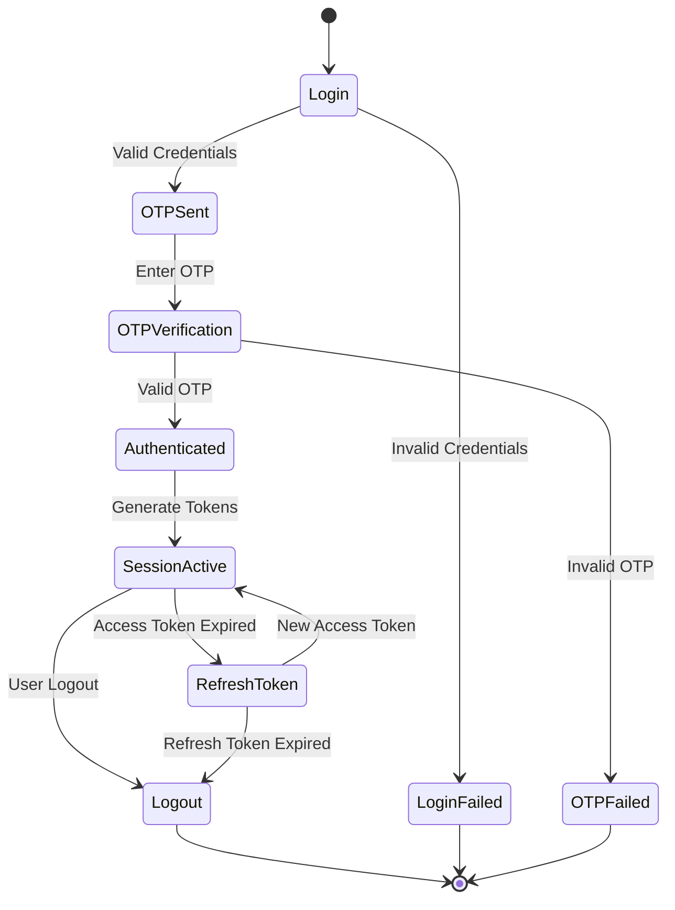

# Technical Architecture Document
## Aplikasi Pinjol KreditKu - TrailBase Implementation

### Version: 1.0
### Date: December 2024

---

## 1. System Overview

### 1.1 Architecture Philosophy
KreditKu mengadopsi arsitektur modular berbasis microservices dengan TrailBase sebagai core backend. Sistem dirancang dengan prinsip:
- **Scalability**: Horizontal scaling untuk handle growth
- **Reliability**: High availability dengan failover mechanism
- **Security**: Defense in depth dengan multiple security layers
- **Performance**: Sub-second response time
- **Maintainability**: Clean architecture dengan separation of concerns

### 1.2 High-Level Architecture



---

## 2. Technology Stack

### 2.1 Core Technologies

| Layer | Technology | Version | Justification |
|-------|------------|---------|---------------|
| **Backend Core** | TrailBase | Latest | High performance, built-in auth, single executable |
| **Database** | SQLite | 3.x | Built into TrailBase, excellent performance |
| **Runtime** | V8 (TrailBase) | Latest | JavaScript/TypeScript support |
| **Cache** | Redis | 7.x | Session management, rate limiting |
| **Mobile** | Flutter | 3.x | Cross-platform, native performance |
| **Web** | React | 18.x | Component-based, large ecosystem |
| **Queue** | TrailBase Jobs | Built-in | Background processing |
| **Storage** | MinIO/S3 | Latest | Object storage for documents |

### 2.2 Development Stack

| Tool | Purpose | Version |
|------|---------|---------|
| **TypeScript** | Type safety for TrailBase extensions | 5.x |
| **Dart** | Flutter development | 3.x |
| **Docker** | Containerization | Latest |
| **Git** | Version control | Latest |
| **GitHub Actions** | CI/CD | Latest |
| **Jest** | JavaScript testing | Latest |
| **Flutter Test** | Mobile testing | Built-in |

### 2.3 Infrastructure Stack

| Component | Technology | Purpose |
|-----------|------------|---------|
| **Cloud Provider** | AWS/GCP/Azure | Hosting infrastructure |
| **CDN** | CloudFlare | Static asset delivery |
| **Load Balancer** | Nginx/ALB | Traffic distribution |
| **Monitoring** | Prometheus + Grafana | System monitoring |
| **Logging** | ELK Stack | Centralized logging |
| **APM** | DataDog/New Relic | Application monitoring |

---

## 3. Component Architecture

### 3.1 Backend Services Architecture

#### 3.1.1 TrailBase Core Configuration

```javascript
// traildepot/config.js
export default {
  server: {
    host: '0.0.0.0',
    port: 4000,
    workers: 4,
    maxConnections: 10000
  },
  
  database: {
    path: './traildepot/kreditku.db',
    mode: 'WAL',
    busyTimeout: 5000,
    cacheSize: 10000,
    synchronous: 'NORMAL'
  },
  
  auth: {
    jwt: {
      secret: process.env.JWT_SECRET,
      accessTokenExpiry: '15m',
      refreshTokenExpiry: '7d',
      algorithm: 'HS256'
    },
    
    oauth: {
      google: {
        clientId: process.env.GOOGLE_CLIENT_ID,
        clientSecret: process.env.GOOGLE_CLIENT_SECRET
      }
    }
  },
  
  security: {
    cors: {
      origins: [
        'https://admin.kreditku.id',
        'https://kreditku.id',
        'app://kreditku'
      ],
      credentials: true
    },
    
    rateLimit: {
      global: 1000,
      perUser: 100,
      perEndpoint: {
        '/api/auth/login': 5,
        '/api/auth/register': 3,
        '/api/loans/apply': 10
      }
    },
    
    headers: {
      'X-Frame-Options': 'DENY',
      'X-Content-Type-Options': 'nosniff',
      'X-XSS-Protection': '1; mode=block',
      'Strict-Transport-Security': 'max-age=31536000; includeSubDomains'
    }
  }
};
```

#### 3.1.2 Service Layer Architecture

```typescript
// Service Layer Pattern
interface ServiceArchitecture {
  controllers: {
    // HTTP request handling
    AuthController: ['login', 'logout', 'refresh', 'verify'];
    LoanController: ['apply', 'approve', 'reject', 'disburse'];
    PaymentController: ['create', 'confirm', 'refund'];
  };
  
  services: {
    // Business logic
    AuthService: ['authenticate', 'generateTokens', 'validateOTP'];
    LoanService: ['createApplication', 'calculateTerms', 'processApproval'];
    PaymentService: ['processPayment', 'reconcile', 'generateVA'];
  };
  
  repositories: {
    // Data access
    UserRepository: ['findById', 'findByPhone', 'create', 'update'];
    LoanRepository: ['create', 'findByUser', 'updateStatus'];
    PaymentRepository: ['create', 'findByLoan', 'updateStatus'];
  };
  
  validators: {
    // Input validation
    AuthValidator: ['validateLogin', 'validateRegistration'];
    LoanValidator: ['validateApplication', 'validateAmount'];
    PaymentValidator: ['validatePayment', 'validateRefund'];
  };
}
```

### 3.2 Mobile Application Architecture

#### 3.2.1 Flutter App Structure

```dart
// lib/main.dart
import 'package:flutter/material.dart';
import 'package:provider/provider.dart';
import 'package:kreditku/core/di/injection.dart';

void main() async {
  WidgetsFlutterBinding.ensureInitialized();
  await configureDependencies();
  runApp(KreditKuApp());
}

class KreditKuApp extends StatelessWidget {
  @override
  Widget build(BuildContext context) {
    return MultiProvider(
      providers: [
        ChangeNotifierProvider(create: (_) => getIt<AuthProvider>()),
        ChangeNotifierProvider(create: (_) => getIt<LoanProvider>()),
        ChangeNotifierProvider(create: (_) => getIt<PaymentProvider>()),
      ],
      child: MaterialApp(
        title: 'KreditKu',
        theme: AppTheme.light(),
        darkTheme: AppTheme.dark(),
        initialRoute: AppRoutes.splash,
        onGenerateRoute: AppRouter.generateRoute,
      ),
    );
  }
}
```

#### 3.2.2 Clean Architecture Layers

```
lib/
├── presentation/          # UI Layer
│   ├── screens/
│   ├── widgets/
│   └── themes/
├── domain/               # Business Logic
│   ├── entities/
│   ├── repositories/
│   └── usecases/
├── data/                 # Data Layer
│   ├── models/
│   ├── datasources/
│   └── repositories/
└── core/                 # Core Utilities
    ├── constants/
    ├── errors/
    ├── network/
    └── utils/
```

### 3.3 Web Dashboard Architecture

#### 3.3.1 React Application Structure

```typescript
// src/App.tsx
import React from 'react';
import { BrowserRouter } from 'react-router-dom';
import { QueryClient, QueryClientProvider } from 'react-query';
import { ConfigProvider } from 'antd';
import { AuthProvider } from './contexts/AuthContext';
import { AppRoutes } from './routes';

const queryClient = new QueryClient({
  defaultOptions: {
    queries: {
      retry: 3,
      refetchOnWindowFocus: false,
      staleTime: 5 * 60 * 1000, // 5 minutes
    },
  },
});

export const App: React.FC = () => {
  return (
    <ConfigProvider theme={customTheme}>
      <QueryClientProvider client={queryClient}>
        <BrowserRouter>
          <AuthProvider>
            <AppRoutes />
          </AuthProvider>
        </BrowserRouter>
      </QueryClientProvider>
    </ConfigProvider>
  );
};
```

#### 3.3.2 State Management with Zustand

```typescript
// stores/loanStore.ts
import create from 'zustand';
import { devtools, persist } from 'zustand/middleware';

interface LoanState {
  loans: Loan[];
  selectedLoan: Loan | null;
  filters: LoanFilters;
  
  // Actions
  fetchLoans: () => Promise<void>;
  selectLoan: (loan: Loan) => void;
  updateLoanStatus: (loanId: string, status: string) => Promise<void>;
  setFilters: (filters: Partial<LoanFilters>) => void;
}

export const useLoanStore = create<LoanState>()(
  devtools(
    persist(
      (set, get) => ({
        loans: [],
        selectedLoan: null,
        filters: defaultFilters,
        
        fetchLoans: async () => {
          const loans = await api.loans.getAll(get().filters);
          set({ loans });
        },
        
        selectLoan: (loan) => set({ selectedLoan: loan }),
        
        updateLoanStatus: async (loanId, status) => {
          await api.loans.updateStatus(loanId, status);
          await get().fetchLoans();
        },
        
        setFilters: (filters) => {
          set((state) => ({ filters: { ...state.filters, ...filters } }));
          get().fetchLoans();
        },
      }),
      { name: 'loan-storage' }
    )
  )
);
```

---

## 4. Data Architecture

### 4.1 Database Design Principles

1. **Normalization**: 3NF for transactional data
2. **Denormalization**: Strategic denormalization for read-heavy operations
3. **Partitioning**: Time-based partitioning for historical data
4. **Indexing**: Covering indexes for frequent queries
5. **Archival**: Automatic archival of old data

### 4.2 Caching Strategy

```typescript
// Caching Layer Implementation
class CacheService {
  private redis: Redis;
  
  constructor() {
    this.redis = new Redis({
      host: process.env.REDIS_HOST,
      port: parseInt(process.env.REDIS_PORT),
      password: process.env.REDIS_PASSWORD,
      db: 0,
      keyPrefix: 'kreditku:',
    });
  }
  
  // Cache Strategies
  async getOrSet<T>(
    key: string, 
    factory: () => Promise<T>, 
    ttl: number = 300
  ): Promise<T> {
    const cached = await this.redis.get(key);
    if (cached) {
      return JSON.parse(cached);
    }
    
    const value = await factory();
    await this.redis.setex(key, ttl, JSON.stringify(value));
    return value;
  }
  
  // Cache Patterns
  patterns = {
    user: (userId: string) => `user:${userId}`,
    loan: (loanId: string) => `loan:${loanId}`,
    session: (sessionId: string) => `session:${sessionId}`,
    otp: (phone: string) => `otp:${phone}`,
    rateLimit: (key: string) => `rate:${key}`,
  };
  
  // Cache Invalidation
  async invalidate(pattern: string): Promise<void> {
    const keys = await this.redis.keys(`kreditku:${pattern}*`);
    if (keys.length > 0) {
      await this.redis.del(...keys);
    }
  }
}
```

### 4.3 Data Flow Architecture



---

## 5. Security Architecture

### 5.1 Security Layers

```typescript
// Security Middleware Stack
const securityMiddleware = {
  // 1. Rate Limiting
  rateLimiter: rateLimit({
    windowMs: 60 * 1000,
    max: 100,
    message: 'Too many requests',
    standardHeaders: true,
    legacyHeaders: false,
  }),
  
  // 2. Input Validation
  validator: (schema: Schema) => (req, res, next) => {
    const { error, value } = schema.validate(req.body);
    if (error) {
      return res.status(400).json({ error: error.details });
    }
    req.body = value;
    next();
  },
  
  // 3. Authentication
  authenticate: async (req, res, next) => {
    const token = req.headers.authorization?.split(' ')[1];
    if (!token) {
      return res.status(401).json({ error: 'No token provided' });
    }
    
    try {
      const payload = jwt.verify(token, config.jwt.secret);
      req.user = await userService.findById(payload.userId);
      next();
    } catch (error) {
      return res.status(401).json({ error: 'Invalid token' });
    }
  },
  
  // 4. Authorization
  authorize: (...roles: string[]) => (req, res, next) => {
    if (!roles.includes(req.user.role)) {
      return res.status(403).json({ error: 'Forbidden' });
    }
    next();
  },
  
  // 5. Encryption
  encrypt: (data: any) => {
    const cipher = crypto.createCipher('aes-256-gcm', config.encryption.key);
    return cipher.update(JSON.stringify(data), 'utf8', 'hex') + cipher.final('hex');
  },
};
```

### 5.2 Authentication Flow



### 5.3 API Security Headers

```javascript
// Security Headers Configuration
const securityHeaders = {
  // Prevent clickjacking
  'X-Frame-Options': 'DENY',
  
  // Prevent MIME type sniffing
  'X-Content-Type-Options': 'nosniff',
  
  // Enable XSS protection
  'X-XSS-Protection': '1; mode=block',
  
  // Force HTTPS
  'Strict-Transport-Security': 'max-age=31536000; includeSubDomains',
  
  // Content Security Policy
  'Content-Security-Policy': "default-src 'self'; script-src 'self' 'unsafe-inline'; style-src 'self' 'unsafe-inline'",
  
  // Referrer Policy
  'Referrer-Policy': 'strict-origin-when-cross-origin',
  
  // Permissions Policy
  'Permissions-Policy': 'camera=(), microphone=(), geolocation=(self)',
};
```

---

## 6. Integration Architecture

### 6.1 External Service Integration

```typescript
// Integration Service Pattern
abstract class IntegrationService<TRequest, TResponse> {
  protected abstract endpoint: string;
  protected abstract apiKey: string;
  
  protected async request(data: TRequest): Promise<TResponse> {
    try {
      const response = await axios.post(this.endpoint, data, {
        headers: {
          'Authorization': `Bearer ${this.apiKey}`,
          'Content-Type': 'application/json',
        },
        timeout: 30000,
      });
      
      await this.logIntegration(data, response.data);
      return response.data;
      
    } catch (error) {
      await this.handleError(error, data);
      throw new IntegrationError(error.message);
    }
  }
  
  protected abstract logIntegration(request: TRequest, response: TResponse): Promise<void>;
  protected abstract handleError(error: any, request: TRequest): Promise<void>;
}

// Payment Gateway Integration
class PaymentGatewayService extends IntegrationService<PaymentRequest, PaymentResponse> {
  protected endpoint = process.env.PAYMENT_GATEWAY_URL;
  protected apiKey = process.env.PAYMENT_GATEWAY_KEY;
  
  async createVirtualAccount(data: VARequest): Promise<VAResponse> {
    return this.request({
      type: 'VIRTUAL_ACCOUNT',
      ...data,
    });
  }
  
  async checkStatus(paymentId: string): Promise<PaymentStatus> {
    return this.request({
      type: 'STATUS_CHECK',
      paymentId,
    });
  }
}
```

### 6.2 Webhook Processing

```typescript
// Webhook Handler Architecture
class WebhookProcessor {
  private handlers: Map<string, WebhookHandler> = new Map();
  
  register(event: string, handler: WebhookHandler) {
    this.handlers.set(event, handler);
  }
  
  async process(webhook: Webhook): Promise<void> {
    // Validate signature
    if (!this.validateSignature(webhook)) {
      throw new Error('Invalid webhook signature');
    }
    
    // Check idempotency
    if (await this.isDuplicate(webhook.id)) {
      return;
    }
    
    // Process webhook
    const handler = this.handlers.get(webhook.event);
    if (!handler) {
      throw new Error(`No handler for event: ${webhook.event}`);
    }
    
    try {
      await handler.handle(webhook.data);
      await this.markProcessed(webhook.id);
    } catch (error) {
      await this.markFailed(webhook.id, error);
      throw error;
    }
  }
  
  private validateSignature(webhook: Webhook): boolean {
    const signature = crypto
      .createHmac('sha256', process.env.WEBHOOK_SECRET)
      .update(JSON.stringify(webhook.data))
      .digest('hex');
    
    return signature === webhook.signature;
  }
}
```

---

## 7. Deployment Architecture

### 7.1 Container Architecture

```dockerfile
# Dockerfile
FROM node:18-alpine AS builder

WORKDIR /app
COPY package*.json ./
RUN npm ci --only=production

COPY . .
RUN npm run build

FROM gcr.io/distroless/nodejs18-debian11

WORKDIR /app
COPY --from=builder /app/dist ./dist
COPY --from=builder /app/node_modules ./node_modules
COPY --from=builder /app/traildepot ./traildepot

EXPOSE 4000

CMD ["dist/index.js"]
```

### 7.2 Kubernetes Deployment

```yaml
# k8s/deployment.yaml
apiVersion: apps/v1
kind: Deployment
metadata:
  name: kreditku-api
  namespace: production
spec:
  replicas: 3
  selector:
    matchLabels:
      app: kreditku-api
  template:
    metadata:
      labels:
        app: kreditku-api
    spec:
      containers:
      - name: api
        image: kreditku/api:latest
        ports:
        - containerPort: 4000
        env:
        - name: NODE_ENV
          value: "production"
        - name: JWT_SECRET
          valueFrom:
            secretKeyRef:
              name: kreditku-secrets
              key: jwt-secret
        resources:
          requests:
            memory: "512Mi"
            cpu: "500m"
          limits:
            memory: "1Gi"
            cpu: "1000m"
        livenessProbe:
          httpGet:
            path: /health
            port: 4000
          initialDelaySeconds: 30
          periodSeconds: 10
        readinessProbe:
          httpGet:
            path: /ready
            port: 4000
          initialDelaySeconds: 5
          periodSeconds: 5
---
apiVersion: v1
kind: Service
metadata:
  name: kreditku-api-service
  namespace: production
spec:
  selector:
    app: kreditku-api
  ports:
    - protocol: TCP
      port: 80
      targetPort: 4000
  type: LoadBalancer
```

### 7.3 CI/CD Pipeline

```yaml
# .github/workflows/deploy.yml
name: Deploy to Production

on:
  push:
    branches: [main]

jobs:
  test:
    runs-on: ubuntu-latest
    steps:
      - uses: actions/checkout@v3
      - uses: actions/setup-node@v3
        with:
          node-version: '18'
      - run: npm ci
      - run: npm test
      - run: npm run test:e2e
      
  build:
    needs: test
    runs-on: ubuntu-latest
    steps:
      - uses: actions/checkout@v3
      - name: Build Docker image
        run: |
          docker build -t kreditku/api:${{ github.sha }} .
          docker tag kreditku/api:${{ github.sha }} kreditku/api:latest
      - name: Push to Registry
        run: |
          echo ${{ secrets.DOCKER_PASSWORD }} | docker login -u ${{ secrets.DOCKER_USERNAME }} --password-stdin
          docker push kreditku/api:${{ github.sha }}
          docker push kreditku/api:latest
          
  deploy:
    needs: build
    runs-on: ubuntu-latest
    steps:
      - name: Deploy to Kubernetes
        run: |
          kubectl set image deployment/kreditku-api api=kreditku/api:${{ github.sha }} -n production
          kubectl rollout status deployment/kreditku-api -n production
```

---

## 8. Performance Architecture

### 8.1 Performance Optimization Strategies

```typescript
// Performance Optimizations
const performanceOptimizations = {
  // 1. Database Query Optimization
  databaseOptimization: {
    // Use prepared statements
    preparedStatements: true,
    
    // Connection pooling
    connectionPool: {
      min: 5,
      max: 20,
      idleTimeout: 30000,
    },
    
    // Query result caching
    queryCache: {
      enabled: true,
      ttl: 300,
    },
    
    // Batch operations
    batchSize: 1000,
  },
  
  // 2. API Response Optimization
  apiOptimization: {
    // Response compression
    compression: {
      enabled: true,
      level: 6,
    },
    
    // Pagination
    pagination: {
      defaultLimit: 20,
      maxLimit: 100,
    },
    
    // Field filtering
    fieldSelection: true,
    
    // Response caching
    httpCache: {
      enabled: true,
      maxAge: 300,
    },
  },
  
  // 3. Asset Optimization
  assetOptimization: {
    // Image optimization
    imageProcessing: {
      formats: ['webp', 'avif'],
      sizes: [320, 640, 1280],
      quality: 85,
    },
    
    // CDN configuration
    cdn: {
      enabled: true,
      providers: ['cloudflare'],
      ttl: 86400,
    },
  },
};
```

### 8.2 Load Testing Scenarios

```javascript
// k6 Load Test Script
import http from 'k6/http';
import { check, sleep } from 'k6';
import { Rate } from 'k6/metrics';

const errorRate = new Rate('errors');

export const options = {
  stages: [
    { duration: '2m', target: 100 },  // Ramp up
    { duration: '5m', target: 100 },  // Stay at 100
    { duration: '2m', target: 200 },  // Ramp to 200
    { duration: '5m', target: 200 },  // Stay at 200
    { duration: '2m', target: 0 },    // Ramp down
  ],
  thresholds: {
    http_req_duration: ['p(95)<500'], // 95% under 500ms
    errors: ['rate<0.1'],              // Error rate under 10%
  },
};

export default function() {
  // Test loan application endpoint
  const payload = JSON.stringify({
    amount: 5000000,
    tenor: 30,
    purpose: 'working_capital',
  });
  
  const params = {
    headers: {
      'Content-Type': 'application/json',
      'Authorization': 'Bearer ' + __ENV.TOKEN,
    },
  };
  
  const response = http.post(
    'https://api.kreditku.id/loans/apply',
    payload,
    params
  );
  
  const success = check(response, {
    'status is 200': (r) => r.status === 200,
    'response time < 500ms': (r) => r.timings.duration < 500,
  });
  
  errorRate.add(!success);
  sleep(1);
}
```

---

## 9. Monitoring & Observability

### 9.1 Monitoring Stack

```yaml
# docker-compose.monitoring.yml
version: '3.8'

services:
  prometheus:
    image: prom/prometheus:latest
    volumes:
      - ./prometheus.yml:/etc/prometheus/prometheus.yml
      - prometheus-data:/prometheus
    ports:
      - "9090:9090"
      
  grafana:
    image: grafana/grafana:latest
    volumes:
      - grafana-data:/var/lib/grafana
      - ./grafana/dashboards:/etc/grafana/provisioning/dashboards
    ports:
      - "3000:3000"
    environment:
      - GF_SECURITY_ADMIN_PASSWORD=admin
      
  loki:
    image: grafana/loki:latest
    volumes:
      - ./loki-config.yml:/etc/loki/local-config.yaml
      - loki-data:/loki
    ports:
      - "3100:3100"
      
  promtail:
    image: grafana/promtail:latest
    volumes:
      - ./promtail-config.yml:/etc/promtail/config.yml
      - /var/log:/var/log
    
  alertmanager:
    image: prom/alertmanager:latest
    volumes:
      - ./alertmanager.yml:/etc/alertmanager/alertmanager.yml
    ports:
      - "9093:9093"

volumes:
  prometheus-data:
  grafana-data:
  loki-data:
```

### 9.2 Application Metrics

```typescript
// Metrics Collection
import { Counter, Histogram, Gauge, register } from 'prom-client';

export const metrics = {
  // HTTP Metrics
  httpRequestDuration: new Histogram({
    name: 'http_request_duration_seconds',
    help: 'Duration of HTTP requests in seconds',
    labelNames: ['method', 'route', 'status'],
    buckets: [0.1, 0.5, 1, 2, 5],
  }),
  
  httpRequestTotal: new Counter({
    name: 'http_requests_total',
    help: 'Total number of HTTP requests',
    labelNames: ['method', 'route', 'status'],
  }),
  
  // Business Metrics
  loanApplications: new Counter({
    name: 'loan_applications_total',
    help: 'Total number of loan applications',
    labelNames: ['status', 'type'],
  }),
  
  activeLoans: new Gauge({
    name: 'active_loans_count',
    help: 'Number of active loans',
  }),
  
  paymentTransactions: new Counter({
    name: 'payment_transactions_total',
    help: 'Total number of payment transactions',
    labelNames: ['status', 'method'],
  }),
  
  // System Metrics
  databaseConnections: new Gauge({
    name: 'database_connections_active',
    help: 'Number of active database connections',
  }),
  
  cacheHitRate: new Gauge({
    name: 'cache_hit_rate',
    help: 'Cache hit rate percentage',
  }),
};

// Metrics Endpoint
app.get('/metrics', async (req, res) => {
  res.set('Content-Type', register.contentType);
  res.end(await register.metrics());
});
```

---

## 10. Disaster Recovery

### 10.1 Backup Strategy

```bash
#!/bin/bash
# backup.sh

# Configuration
BACKUP_DIR="/backup"
S3_BUCKET="s3://kreditku-backups"
DATE=$(date +%Y%m%d_%H%M%S)
RETENTION_DAYS=30

# Database Backup
echo "Starting database backup..."
sqlite3 /app/traildepot/kreditku.db ".backup ${BACKUP_DIR}/db_${DATE}.sqlite"

# Compress backup
tar -czf ${BACKUP_DIR}/backup_${DATE}.tar.gz ${BACKUP_DIR}/db_${DATE}.sqlite

# Upload to S3
aws s3 cp ${BACKUP_DIR}/backup_${DATE}.tar.gz ${S3_BUCKET}/daily/

# Clean up old backups
find ${BACKUP_DIR} -type f -mtime +${RETENTION_DAYS} -delete
aws s3 ls ${S3_BUCKET}/daily/ | while read -r line; do
  createDate=$(echo $line | awk '{print $1" "$2}')
  createDate=$(date -d "$createDate" +%s)
  olderThan=$(date -d "${RETENTION_DAYS} days ago" +%s)
  if [[ $createDate -lt $olderThan ]]; then
    fileName=$(echo $line | awk '{print $4}')
    aws s3 rm ${S3_BUCKET}/daily/${fileName}
  fi
done

echo "Backup completed successfully"
```

### 10.2 Recovery Procedures

```typescript
// Disaster Recovery Service
class DisasterRecoveryService {
  async performHealthCheck(): Promise<HealthStatus> {
    const checks = {
      database: await this.checkDatabase(),
      cache: await this.checkCache(),
      storage: await this.checkStorage(),
      external: await this.checkExternalServices(),
    };
    
    const overall = Object.values(checks).every(c => c.healthy);
    
    return {
      healthy: overall,
      checks,
      timestamp: new Date(),
    };
  }
  
  async initiateFailover(): Promise<void> {
    // 1. Switch to read-only mode
    await this.enableReadOnlyMode();
    
    // 2. Backup current state
    await this.backupCurrentState();
    
    // 3. Switch DNS to standby region
    await this.switchDNS();
    
    // 4. Restore from latest backup
    await this.restoreFromBackup();
    
    // 5. Validate data integrity
    await this.validateDataIntegrity();
    
    // 6. Resume operations
    await this.resumeOperations();
  }
  
  async rollback(): Promise<void> {
    // Rollback procedures
    await this.restoreFromSnapshot();
    await this.validateRollback();
    await this.notifyStakeholders();
  }
}
```

---

## 11. Scalability Considerations

### 11.1 Horizontal Scaling Strategy

```yaml
# Horizontal Pod Autoscaler
apiVersion: autoscaling/v2
kind: HorizontalPodAutoscaler
metadata:
  name: kreditku-api-hpa
  namespace: production
spec:
  scaleTargetRef:
    apiVersion: apps/v1
    kind: Deployment
    name: kreditku-api
  minReplicas: 3
  maxReplicas: 20
  metrics:
  - type: Resource
    resource:
      name: cpu
      target:
        type: Utilization
        averageUtilization: 70
  - type: Resource
    resource:
      name: memory
      target:
        type: Utilization
        averageUtilization: 80
  - type: Pods
    pods:
      metric:
        name: http_requests_per_second
      target:
        type: AverageValue
        averageValue: "1000"
  behavior:
    scaleDown:
      stabilizationWindowSeconds: 300
      policies:
      - type: Percent
        value: 50
        periodSeconds: 60
    scaleUp:
      stabilizationWindowSeconds: 60
      policies:
      - type: Percent
        value: 100
        periodSeconds: 60
```

### 11.2 Database Scaling

```sql
-- Partitioning Strategy for Large Tables
CREATE TABLE loans_2024_q1 PARTITION OF loans
FOR VALUES FROM ('2024-01-01') TO ('2024-04-01');

CREATE TABLE loans_2024_q2 PARTITION OF loans
FOR VALUES FROM ('2024-04-01') TO ('2024-07-01');

-- Read Replica Configuration
CREATE PUBLICATION loan_publication FOR TABLE loans, payments;

-- On replica
CREATE SUBSCRIPTION loan_subscription
CONNECTION 'host=primary dbname=kreditku'
PUBLICATION loan_publication;
```

---

## 12. Development Guidelines

### 12.1 Code Standards

```typescript
// Code Style Guidelines
const codeStandards = {
  // Naming Conventions
  naming: {
    files: 'kebab-case',
    classes: 'PascalCase',
    interfaces: 'IPascalCase',
    functions: 'camelCase',
    constants: 'UPPER_SNAKE_CASE',
    variables: 'camelCase',
  },
  
  // File Organization
  structure: {
    maxLinesPerFile: 500,
    maxLinesPerFunction: 50,
    maxParameters: 4,
    maxNestingDepth: 4,
  },
  
  // Documentation
  documentation: {
    required: ['public APIs', 'complex logic', 'business rules'],
    format: 'JSDoc',
    examples: true,
  },
  
  // Testing
  testing: {
    coverage: {
      statements: 80,
      branches: 75,
      functions: 80,
      lines: 80,
    },
    naming: 'should [expected behavior] when [condition]',
  },
};
```

### 12.2 Git Workflow

```bash
# Git Flow
main
├── develop
│   ├── feature/loan-application
│   ├── feature/payment-gateway
│   └── feature/kyc-verification
├── release/v1.0.0
└── hotfix/critical-bug

# Commit Message Format
<type>(<scope>): <subject>

<body>

<footer>

# Types: feat, fix, docs, style, refactor, test, chore
# Example:
feat(loan): add auto-approval for high credit scores

Implement automatic loan approval for users with credit scores
above 700 and loan amounts below 10 million IDR.

Closes #123
```

---

## 13. Documentation Requirements

### 13.1 API Documentation

```typescript
/**
 * @swagger
 * /api/loans/apply:
 *   post:
 *     summary: Apply for a new loan
 *     tags: [Loans]
 *     security:
 *       - bearerAuth: []
 *     requestBody:
 *       required: true
 *       content:
 *         application/json:
 *           schema:
 *             type: object
 *             required:
 *               - amount
 *               - tenor
 *               - purpose
 *             properties:
 *               amount:
 *                 type: integer
 *                 minimum: 1000000
 *                 maximum: 50000000
 *                 description: Loan amount in IDR
 *               tenor:
 *                 type: integer
 *                 minimum: 7
 *                 maximum: 90
 *                 description: Loan tenor in days
 *               purpose:
 *                 type: string
 *                 enum: [working_capital, education, healthcare, emergency]
 *                 description: Purpose of the loan
 *     responses:
 *       201:
 *         description: Loan application created successfully
 *         content:
 *           application/json:
 *             schema:
 *               $ref: '#/components/schemas/LoanApplication'
 *       400:
 *         description: Invalid input data
 *       401:
 *         description: Unauthorized
 *       429:
 *         description: Too many requests
 */
```

---

## Conclusion

This technical architecture provides a robust, scalable, and secure foundation for the KreditKu pinjol application. The use of TrailBase as the core backend platform, combined with modern development practices and comprehensive monitoring, ensures the system can handle growth while maintaining high performance and reliability.

Key architectural decisions:
1. **TrailBase**: Provides excellent performance with minimal operational overhead
2. **SQLite**: Surprisingly powerful for this use case with proper optimization
3. **Microservices**: Allows independent scaling and development
4. **Event-driven**: Enables loose coupling and better scalability
5. **Security-first**: Multiple layers of security throughout the stack

---

*End of Technical Architecture Document*